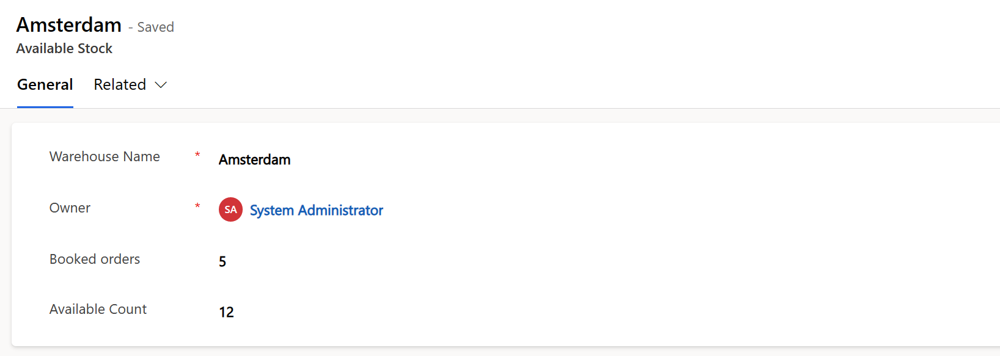
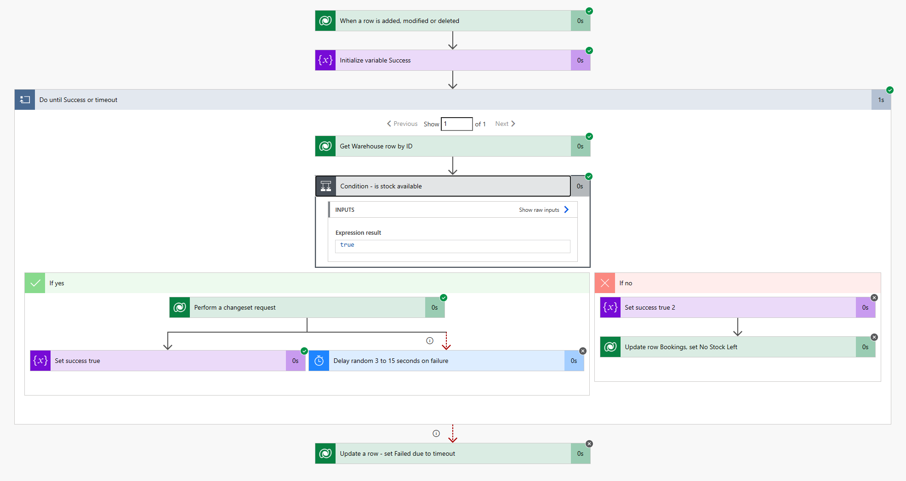

#PowerAutomate #PowerAutomateCloud #Dataverse

# Reliable Concurrent Booking with Power Automate

Users want to record their bookings against some specific inventory - be it stocks in a warehouse or seats in a classroom training. The super straightforward solution in Power Automate would probably respond to new bookings being created, and would do so by updating the available count in one table, and the booking's confirmed status in another. But in a mass concurrent world of Power Automate, it is not easy to ensure that nobody else will be making their changes at the same time. Such collission would quickly lead to data corruption, and two users thinking they succeeded in booking one resource.

## Demo
In a warehouse called Amsterdam, we have 12 items available, and 5 were booked earlier: 

Now, we start making booking requests. Here, 5 records are submitted all **at once**:

and here, 5 more but this time only 2 items left in warehouse:

## How to solve this with Power Automate?
There's an action called Execute a changeset requst. What it does is it carries out the requested actions (must be a combination of creating, updating or deleting records), but only commits all the changes if all actions are successful at the same time.

## How to use changeset in our case?
Create a table with a unique index, where each row will represent one successful booking. Then, in one changeset execute three operations:
* save a record in our unique index table,
* update the booking to say it succeeded
* update the warehouse to reflect new, lower count of available items

If two processes **try** try to book **the same** item, then one of them will succeed, and the other will fail and rollback all it's chanages. Then, all you have to do is wait a moment (ideally: random) and try again.

## Notes
Should you want to try the attached solution - please make sure you create a record first in the *Available stock* table with your warehouse namme and *Available count* being set to somewhat high number like 20 or 50. Then, run the supplied flow that will very quickly create 25 new booking records, and look at the Booking table to see your flow at work.
